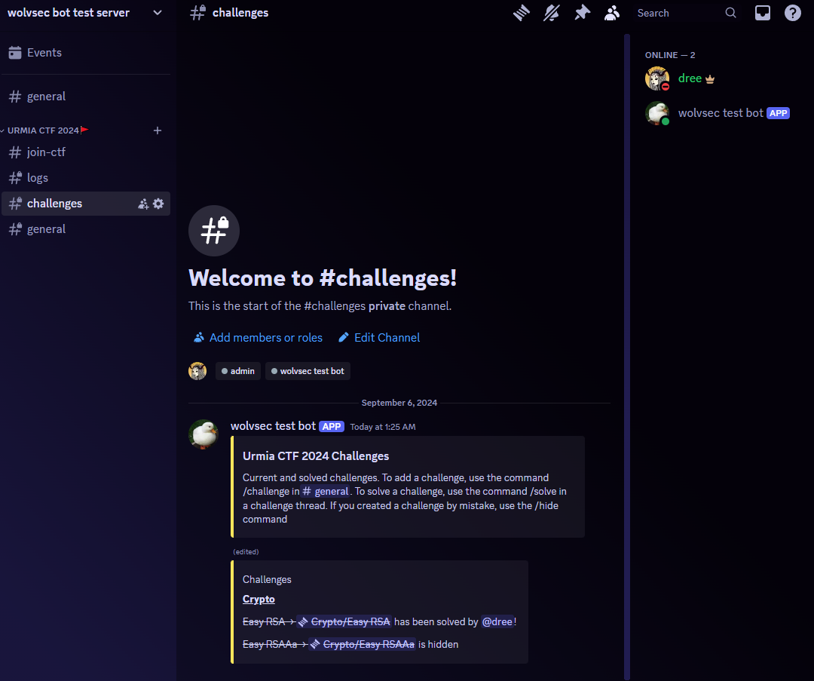

# CTF-Bot
This is a Discord bot that is used to parse ctftime.org and make managing CTF channels easier.

## Testing
### Enviornment Variables
- To test the bot, first declare the following enivornment variables in a `.env` file in the root directory
The following variables need to be defined:
```
TOKEN=
CTF_VERIFIED_ROLE_ID=
OFFICER_ROLE_ID=
ARCHIVE_CATEGORY_ID=
CTF_CATEGORY_POS=
```
- A token for the bot can be created by going to the Discord Developer Portal and [creating a new bot](https://discord.com/developers/applications?new_application=true)
  - You must then invite your bot to your server
- The role IDs can be created in a Discord and copied as follows
  - 
- The `CTF_CATEGORY_POS` is the position you want new categories to be made in the server
- The `ARCHIVE_CATEGORY_ID` is the category ID where you want the bot to archive channels. Right click the category to get the category ID

### Running Docker
- Use the following commands to build the docker image
- `docker build -t ctf-bot .` to build the image
- `docker run --name ctf-bot-container` to run the container
  - `-v /path/to/directory:/mnt/host/ctfbot -w /mnt/host/ctfbot` to mount the current directory to the container so that it will be easier to access the `data.json` file for debugging
- You can use `docker rm $(docker ps -a -q)` to remove all containers if you run into an issue

### Testing in Discord
- Use the `/register` command to create a new CTF
- You can insert [this command](documentation/delete_channels.py) into the `cog.py` file to delete all channels in the server if you find yourself testing `/register` often
- You will need to delete `data.json` manually to reset the bot's saved data, or use `/end_ctf` 
- If you edit a command's name or parameters, you need to restart Discord to use it

## Commands
### /upcoming
- Gets upcoming CTFs from the CTFd API
- 

### /event
- Gets the event from the CTFd API using the event ID
-  

### /connect_to_ctfd
- Lets users input their CTFd username to be used in the CSV at the end of the CTF. This is to award CTFd points to users who solve challenges
- 

### /register
- Only an officer can use this command
- Register for a CTF and create the channels
- 
- 
- React to the join message to get access to the CTF channels
- 
- When someone reacts or unreacts to the join message, the bot will send a message in the logs channel
- 

### /challenge
- To create a new challenge, use the **#general** channel in the CTF category to create a new thread. This will let others know that you are working on that challenge, and will let you document your progress!
- 
- 
- This will create a new entry in the **#challenges** channel
- 

### /solve
- To solve a challenge, use the **#challenges** channel to find the the challenge you want to solve. Join the thread and use the `/solve` *after* you have submitted the flag
- 
- This will send a message in the **#general** channel letting everyone know your accomplishment, and update the challenge board
- 

### /hide
- Lets say you created a challenge by mistake. You can use `/hide` to cross it out from the challenge board and close the thread. Use `/hide` again if you want to unhide it.
- 
- 

### /end_ctf
- Only an officer can use this command
- This will end the CTF and move the challenge board to the general channel
- It will also send a CSV file with the solves and users who joined the CTF (marked by 0 solves)
- It will then rename the general channel and move it to the archive category
- This method allows all the CTF data to be condensed into one channel
- It does not delete the channels but marks them as "To be deleted". This is to prevent accidental deletion of channels
- 
- 

## Known Issues
- Line length does not meet PEP8 standards
