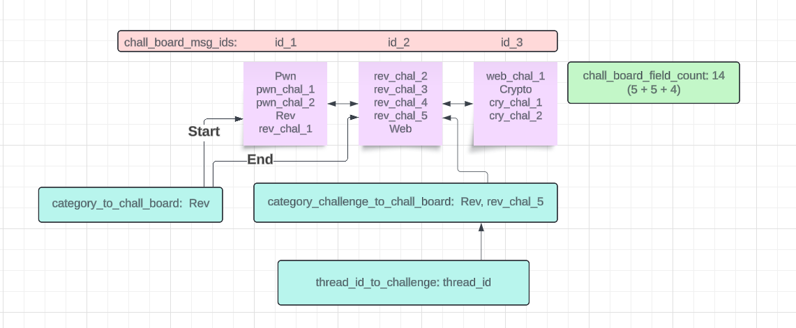

# Data Structures
- These can be found in [ctfbot/data.py](../ctfbot/data.py)
- Brief Overview of data:
  - Global data keeps a list of all servers
    - Server data keeps a list of all events and users
      - Event data keeps a list of challenges and channels
        - Challenge data keeps a list of challenge names and solves
## Global Data
- `servers`: Mapping of server IDs to `Server` objects

## Server Data
- `events`: Mapping of event IDs to `Event` objects
- `event_categories`: Mapping of category IDs to event IDs
  - Used to get the event object from the `discord.ApplicationContext` of a command
- `user_to_ctfd`: Mapping of user IDs to CTFd usernames
  - Used when printing out a the CSV at the end of the event
- `archived_events`: Mapping of event IDs to `Event` objects
  - Used to store events that have ended

## Event Data
- `ctf_verified`: If the event is requires the CTF_VERIFIED_ROLE_ID from the environment variables
  - Used when a the join reaction is added to the join message
- `channel_join`: The join channel id
  - Used to send and check the join message for new reactions
- `channel_logs`: The logs channel id
  - Used to send join/leave logs for the CTF to monitor who has access
- `channel_challenges`: The challenges channel id
  - Used to send the challenge board to easily see what challenges are being worked on and in what thread
- `channel_general`: The general channel id
  - Used to communicate throughout the CTF and send solve messages
- `join_message`: The join message id
  - Used to check for new reactions and add the user to the event
- `challenges`: Holds challenge data in a seperate class to organize the data

## Challenge Data
- `chall_board_msg_ids`: List of all message ids in order that contain the challenge board
  - The embeds can be accessed by accessing the 0th index of each message
- `chall_board_field_count`: The number of fields across all challenge board embeds
  - Used to know when we should grow the challenge board with 
    - From the code: `math.floor((challenges.chall_board_field_count - 1 + space_allocated) / MAX_FIELDS) > len(challenges.chall_board_msg_ids) - 1)` 
- `category_to_chall_board`: Mapping of category strings to the start index (where the category name is) and the last index (last challenge in that category)
  - Used to know where to insert new challenges into the challenge board
  - Position in `chall_board_msg_ids` can be found with index % max_fields
- `category_challenge_to_chall_board`: Mapping of categorys and challenges to their posiition on the challenge board
  - Used to easily update solved and hidden challenges
  - Position in `chall_board_msg_ids` can be found with index % max_fields
- `thread_id_to_challenge` - Mapping of thread ids to challenge names
  - Used to find the challenge a `/solve` or `/hide` command is referencing given the thread context
- Diagram illisturating what a max_fields count of 5 would look like to demonstrate the different mappings of the challenge board

- `hidden_challs`: Set of challenge names that are hidden
- `solved_challs`: Set of challenge names that are solved
- `solves_per_user`: Mapping of user IDs to the number of solves they have
  - Used to print out the CSV at the end of the event
  - Used to print the running count of solves after each solve
  - Users that joined the CTF at any point but have not solved have a solve count of 0
    - This is so the CSV contains all users who accessed the CTF channels incase of investigation

